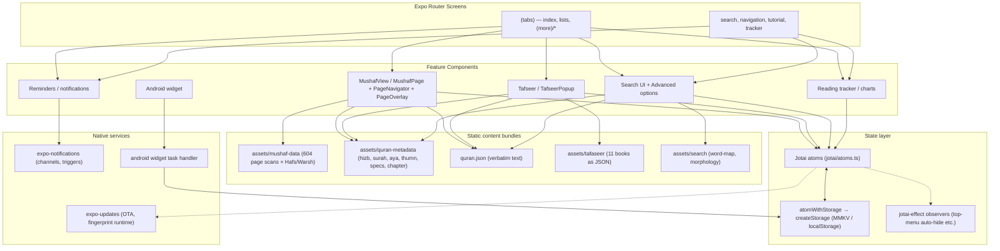

# Open-Mushaf Native — System Design

Engineering documentation for the Open-Mushaf Native codebase. This describes how the
system is built today so contributors can navigate it and make changes confidently.
For usage documentation, see `docs/`. For AI-assistant rules, see `CLAUDE.md`.

Last updated against: version `6.0.1` on branch `main`.

---

## 1. Overview

Open-Mushaf Native is a fully **offline-first Quran reader** (Mushaf) built with
**Expo SDK 54 / React Native 0.81 / TypeScript 5.9**. One codebase ships to four surfaces:

| Surface       | Delivery                                                                                                                            |
| ------------- | ----------------------------------------------------------------------------------------------------------------------------------- |
| Android       | EAS build → Play Store (AAB, `com.adelpro.openmushafnative`)                                                                        |
| iOS           | EAS build → App Store (`ascAppId: 6783070437`)                                                                                      |
| Web           | Static export (`expo export -p web`) → PWA (Workbox) → Firebase Hosting (`open-mushaf-native.web.app`, custom domain `quran.us.kg`) |
| macOS/Windows | Same codebase runs via Expo web/dev-client (not shipped)                                                                            |

The app is **fully offline**: every piece of content (mushaf page scans, Quran text,
metadata, 11 tafseer books, search indexes) is bundled inside the app binary (or
static export). There are no runtime API calls for content. The only networked
services are cosmetic: OTA updates, contact form (Telegram), and website hosting.

### Key design principles

1. **Offline-first, zero-dependency content.** All Quran content is static assets;
   the app must work with no network at all.
2. **Client-only state.** State is a mix of in-memory React state and Jotai atoms
   persisted to `react-native-mmkv` (native) / `localStorage` (web). No backend.
3. **Platform differences are isolated.** Web gets dedicated modules
   (`*.web.ts`), RTL is force-enabled from the root layout, and native-only
   features (notifications, widgets) are gated by `Platform.OS` checks.
4. **Image pages as the source of truth for reading.** The reader renders scan
   images (604 pages for Hafs, 604 for Warsh); all navigation maps page number →
   image via `require()` maps.

---

## 2. Tech Stack

| Layer          | Choice                                                                                                                    |
| -------------- | ------------------------------------------------------------------------------------------------------------------------- |
| Framework      | Expo SDK 54 (managed workflow, no `ios/`/`android/` folders)                                                              |
| UI             | React Native 0.81 with **New Architecture** (`newArchEnabled: true`) and **React Compiler** (`experiments.reactCompiler`) |
| Language       | TypeScript 5.9, path alias `@/` → repo root                                                                               |
| Routing        | `expo-router` v6 (file-based), typed routes enabled                                                                       |
| State          | **Jotai** (`jotai` + `jotai-effect`); atoms persisted via `atomWithStorage`                                               |
| Local storage  | `react-native-mmkv` (native, sync), `localStorage` (web) via platform-split `utils/storage`                               |
| Web            | `react-native-web`, static rendering, `react-helmet-async` for SEO, Workbox PWA                                           |
| Animations     | `react-native-reanimated` + `react-native-gesture-handler` (v4 / v2)                                                      |
| Fonts          | Amiri (Quran) + Tajawal (UI) via `@expo-google-fonts`                                                                     |
| Search         | `quran-search-engine` npm package + `fuse.js` + bundled indexes                                                           |
| Notifications  | `expo-notifications` (local, scheduled)                                                                                   |
| Android widget | `react-native-android-widget`                                                                                             |
| Build/ship     | EAS (`eas.json`), profiles: `development`, `preview`, `production`                                                        |
| Quality        | ESLint (`--max-warnings=0`), Prettier, TypeScript, Vitest, Husky + commitlint/commitizen                                  |

---

## 3. High-Level Architecture



---

## 4. Directory Layout

```text
app/                     Expo Router routes (entry: index.ts)
  _layout.tsx            Root layout: fonts, RTL, providers, splash, notification channel
  (tabs)/                Main tabs (index = mushaf reader, lists, (more)/)
  (tabs)/(more)/         Settings, reminders, about, contact, privacy
  search.tsx             Search screen
  navigation.tsx         Surah/Aya/Page navigation picker
  tutorial.tsx           Onboarding tour
  tracker.tsx            Daily reading tracker + charts
components/              Feature + UI components (Tafseer, MushafPage, Search*, themed UI)
jotai/                   Global atoms + storage-backed atom factory
hooks/                   Feature hooks: data loading, gestures, image preload, search, charts
constants/               Static maps: page images, riwaya options, reading themes, colors, slides
utils/                   Platform-split helpers (storage/, notifications, rate limiter, metadata utils)
Context/                 NotificationProvider (in-app toast-style notifications)
types/                   Domain types (surah, aya, tafseer, reminder, search, …)
assets/                  quran-metadata/, tafaseer/, mushaf-data/, search/, sounds/, …
widgets/                 Android widget UI (`android.tsx`) + task handler
                         (theme-aware OpenMushaf home-screen widget; see §8.2)
docs/                    Public Arabic user guide (Fumapress site — do NOT put engineering docs here)
design/                  Marketing artwork (banners, logos) — not system artwork
```

---

## 5. State Management (Jotai)

State is Jotai atoms, most persisted. `jotai/atoms.ts` declares:
settings (contrast, riwaya, pan sensitivity, sounds, app appearance), reading position
(`currentSavedPage`, `yesterdayPage`), tutorial state, tafseer tab, notification
settings, daily tracker progress + `readingHistory`, and top/bottom menu states.

**Persistence flow** (`jotai/createAtomWithStorage.ts`):

```text
atomWithStorage(key, initial, createStorage(), { getOnInit: true })
        │
        ▼
utils/storage/createStorage.ts   ── native ──► react-native-mmkv (sync)
utils/storage/createStorage.web.ts ── web ───► window.localStorage
```

`getOnInit: true` means values are hydrated at startup, not lazily on first read —
this matters for the widget and notifications which read store values outside React.

`jotai-effect` (`observe`) powers derived behavior, e.g. auto-hiding the top menu
after `EXPO_PUBLIC_TOP_MENU_HIDE_DURATION_MS` (default 5000ms).

Convention: **no Redux/Zustand/React Context for state**. The sole React Context
is `Context/NotificationProvider.tsx` — the ephemeral in-app toast system, which is
intentionally not persisted.

---

## 6. Content & Data Pipelines

All content is bundled static data, loaded lazily with dynamic `import()`:

### 6.1 Mushaf pages (the reader)

- `constants/imagesMapHafs.ts` / `imagesMapWarsh.ts`: `Record<page, require(...)>`
  mapping 604 pages to scan images in `assets/mushaf-data/`.
- Pages render through `MushafPage` with `expo-image` + image zoom
  (`@likashefqet/react-native-image-zoom`) and fan-based pan gestures.
- `useImagesArray` / `useImagePreloader` prefetch neighbor pages for smooth swiping.

### 6.2 Metadata (`useQuranMetadata` hook)

- Per-riwaya dynamic import of `hizb.json`, `surah.json`, `aya.json`, `thumn.json`,
  `specs.json`, `chapter.json` from `assets/quran-metadata/{riwaya}/`.
- Plus shared verbatim `quran.json` (QuranText for search/tafseer).
- `mushafRiwaya` atom (`hafs` | `warsh`) switches the load; hook re-fires on change.

### 6.3 Tafseer

- 11 books as JSON in `assets/tafaseer/` (tabary, katheer, qortoby, saady, …),
  each ~10–15 MB of HTML text.
- `Tafseer` component loads a book's JSON, `useTafseerContent` finds the entry for
  `(sura, aya)` and renders via `react-native-htmlview` inside a resizable
  `TafseerPopup` bottom sheet.

### 6.4 Search

- Bundled indexes (`word-map.json`, `quran-morphology.json`) + `quran-search-engine`.
- `useQuranSearch` supports multiple modes (simple, lemma, root, semantic,
  phonetic, fuzzy) with a module-level `LRUCache` (100 entries) so repeated
  queries don't re-index.

---

## 7. Navigation & Reading Flow

- **Router**: `expo-router` file-based. Root `Stack` in `app/_layout.tsx` wraps
  `(tabs)` (headerless mushaf reader) plus modal-style screens (`search`,
  `navigation`, `tutorial`, `tracker`, `+not-found`).
- **Tabs**: `app/(tabs)/_layout.tsx` — reader home, lists (surahs/chapters tab),
  and nested `(more)` stack.
- **Reader**: `MushafView-ish` flow = `PageNavigator` (gesture swipe/fan) →
  `MushafPage` (image + overlays) → `PageOverlay` (transparent tafseer/bookmark
  popups on tap zones) → `TopMenu`/`BottomMenu`.
- Last page read persists via `currentSavedPage` atom; "yesterday" tracking keeps
  the resume position inside `yesterdayPage` and syncs on app start.

---

## 8. Platform Integrations

### 8.1 Notifications (native only)

- `utils/notifications.ts`: Android channel `quran-reminders`, permission request,
  scheduling (daily/weekly `DailyTriggerInput`/`WeeklyTriggerInput`), cancel, and
  `syncReminders` — validates OS-scheduled ids against app state and re-schedules
  anything that was lost (e.g. after reboot/restore).
- Used by: reading reminders, Hizb/Juz notifications (`hizbNotification` atom),
  daily-tracker goal notifications.
- Permissions requested in `app.json` Android: `POST_NOTIFICATIONS`,
  `SCHEDULE_EXACT_ALARM`, `RECORD_AUDIO`, `MODIFY_AUDIO_SETTINGS` (expo-audio).

### 8.2 Android home-screen widget

`react-native-android-widget` ships a single `OpenMushaf` widget (configured in
`app.json` plugin). Implementation lives in:

| File                               | Role                                                                  |
| ---------------------------------- | --------------------------------------------------------------------- |
| `widgets/android.tsx`              | Widget UI (layout + theme)                                            |
| `widgets/widget-task-handler.tsx`  | OS widget lifecycle (`WIDGET_ADDED` / `UPDATE` / `RESIZED` / `CLICK`) |
| `hooks/useUpdateAndroidWidget.tsx` | In-app push updates (page change, tracker, theme change)              |

**Data flow.** Both the task handler and the update hook read the **Jotai default
store** (`getDefaultStore()`). MMKV persistence is what makes atom values available
outside React / in the widget process. From `currentSavedPage` + `mushafRiwaya` they
derive surah and hizb; from `dailyTrackerGoal` / `dailyTrackerCompleted` they derive
wird progress. Surah glyph comes from the `open_mushaf_icons` font
(`assets/fonts/`, mapped via `surahToIconChar`).

**Theme.** The widget follows the **system** color scheme (`Appearance.getColorScheme`
in the task handler; `useColorScheme` in the update hook). `colorScheme` is passed as
a prop into `AndroidWidget`. When the OS theme flips while the app is open, the hook
re-renders the widget (`void updateAndroidWidget()`).

Colors come from `constants/Colors.ts` — **not** flat black/white:

| Token                                     | Light                  | Dark                     | Used for                                                         |
| ----------------------------------------- | ---------------------- | ------------------------ | ---------------------------------------------------------------- |
| Background                                | `ivory` `#F9F6EF`      | `ivory` `#2E2E2E`        | Widget fill                                                      |
| Border                                    | `secondary` `#C2B280`  | `secondary` `#A0A07E`    | 2px rounded frame (`borderRadius: 32`)                           |
| Title / surah / info text / ring progress | `primary` `#1E5243`    | `primaryLight` `#62A49B` | Brand text (dark uses `primaryLight` for contrast on dark ivory) |
| Logo + info icons                         | `secondary`            | `secondary`              | Accents                                                          |
| Ring track                                | secondary @ ~40% alpha | secondary @ ~33% alpha   | Inactive arc                                                     |

**Layout** (compact card, ~300×150 mental model; sizes fit inside OS widget bounds):

```text
┌─────────────────────────────────────────┐  ← ivory bg, secondary border, r=32
│           المصحف المفتوح  📖            │  ← primary title + secondary logo
│  (○٪)     الفاتحة     الصفحة / الحزب / الورد │
│  ring     surah glyph   info column (RTL) │
└─────────────────────────────────────────┘
```

- Progress ring: SVG `SvgWidget`, **72×72**, radius 28, stroke 5. Center label is
  `{n}٪` with a small `y` baseline offset (`center + 5`) — Android SVG ignores
  `dominant-baseline`, so vertical centering is manual.
- Surah glyph: icon font size 48, primary / primaryLight.
- Info rows (page, hizb, wird): text size 13 primary; icons size 14 secondary.
- Padding: 12 horizontal / 8 vertical; overflow clipped.

**Update triggers.** Page navigation (`useCurrentPage`), daily tracker changes
(`app/tracker.tsx`), and system light/dark changes (hook `useEffect` on
`colorScheme`). Click action `OPEN_APP` opens the main app.

### 8.3 OTA updates

- `expo-updates` with `runtimeVersion` policy `fingerprint`; updates URL in
  `app.json`. `Update.reloadAsync()` used when forcing RTL on native.
- Update channel per EAS profile (`development` / `preview` / `production`).

### 8.4 SEO (web only)

- `react-helmet-async` + `components/Seo.tsx` inject Open Graph / Twitter tags;
  `app/+html.tsx` renders the static HTML shell.

### 8.5 Contact form

- The contact screen POSTs the form payload to a server-side endpoint
  (`EXPO_PUBLIC_CONTACT_API_URL`). The Telegram bot token and chat id live
  exclusively on the server, which forwards the message; they never appear in
  the client bundle. Client-side rate limiting (`utils/rateLimiter.ts` +
  `constants/ratelimitConfig.ts`) is a UX guard only — the endpoint must
  enforce its own server-side limits.

---

## 9. RTL & Theming

- **RTL-first**: `_layout.tsx` forces `I18nManager.forceRTL(true)` (native reload via
  `Updates.reloadAsync()`; web sets `dir="rtl"` + `lang="ar"` on `<html>`).
- **Dark mode**: persisted `appColorScheme` atom (`system` | `light` | `dark`,
  default `system`) plus `useAppColorScheme`. Explicit dark/light override the
  OS; `system` follows `Appearance`. Native also calls `Appearance.setColorScheme`
  so StatusBar and platform chrome match. Web sets `document.documentElement.style.colorScheme`
  because `react-native-web` has no `Appearance.setColorScheme`.
  Themed components (`ThemedView`, `ThemedText`, `useColors`) consume colors from
  `constants/Colors.ts` and `hooks/useThemeColor.ts`.
- **Android widget theming**: same `Colors` tokens; the widget process still
  follows the **system** scheme via `colorScheme` prop (it does not read
  `appColorScheme`). Dark mode swaps primary → `primaryLight` so green text stays
  readable on dark ivory (see §8.2).
- **Reading themes**: `constants/readingThemes.ts` (background/contrast presets)
  applied by the `mushafContrast` atom.
- Fonts: Amiri for Quran text, Tajawal for UI — loaded via `@expo-google-fonts`
  in the root layout before splash hides. Brand accents: primary `#1E5243`,
  secondary `#C2B280` (lighter secondary in dark: `#A0A07E`).
- Brand palette tokens used across app + widget: `primary`, `primaryLight`,
  `secondary`, `ivory`, `card`, `background`.

---

## 10. Web (PWA) Pipeline

```shell
expo export -p web --clear            (static render to dist/)
  → workbox injectManifest            (Service Worker, precache assets)
  → firebase deploy --only hosting    (Firebase Hosting; custom domain quran.us.kg)
```

- `metro.config.js` adds `react-native-svg-transformer`, web `output: static`
  (SSG per route) so SEO crawlers get full HTML.
- PWA manifests/service-worker via `public/` + `workbox-config.js`.
- Target size: 604-page scans × 2 riwayas dominate bundle weight; images are
  `expo-image` cached. Watch memory via `expo-image` + `@likashefqet` zoom
  components — the reason for image preloading/eviction hooks.

---

## 11. CI/CD & Release

- **Branching**: `main` (release) + `develop` (integration) actives;
  release-versioned branches (`b4.2.0`, `v1.0.x`, …) exist as tags/branches history.
- **EAS profiles** (`eas.json`): `development` (dev client), `preview` (internal
  APK), `production` (stores, `autoIncrement: true`). Submit: Android internal/production,
  iOS production via `ascAppId: 6783070437`.
- **App config**: everything in `app.json` (no native folders). Guarded files:
  `app.json`, `eas.json`, `google-services.json`, `GoogleService-Info.plist` —
  changes must be deliberate (historical App Store rejection from duplicated
  `UIBackgroundModes`).
- **Repo tooling**: Husky pre-commit (lint-staged: eslint + prettier),
  @commitlint conventional commits, commitizen via `yarn commit`.

---

## 12. Testing & Quality Gates

| Gate             | Command                               | Scope                               |
| ---------------- | ------------------------------------- | ----------------------------------- |
| Unit tests       | `yarn test` (Vitest)                  | `components/__tests__`, utils       |
| Type check       | `yarn type-check` (tsc --noEmit)      | whole repo                          |
| Lint             | `yarn lint` (eslint --max-warnings=0) | whole repo                          |
| Format           | `yarn format` / `format:check`        | whole repo                          |
| Web export smoke | `yarn web:export`                     | catches Metro/web incompatibilities |
| Expo doctor      | `yarn doctor`                         | SDK/config health                   |

After touching `.ts`/`.tsx`: run `yarn type-check && yarn lint`. After
web-affecting changes: `yarn web:export`.

---

## 13. Security & Privacy Notes

- No personal data ever leaves the device except the contact form (user-initiated,
  via a server-side endpoint that forwards to Telegram) and analytics-free
  (no Firebase Analytics in repo).
- The Telegram bot token / chat id for the contact form live exclusively
  server-side; the client only knows the public contact endpoint
  (`EXPO_PUBLIC_CONTACT_API_URL`). Never commit `.env`.
- `expo-secure-store` is available for sensitive values (installed, minimal use).
- App Store encryption declaration set in `app.json` (`ITSAppUsesNonExemptEncryption: false`).

---

## 14. Known Design Constraints / Gotchas

- **MMKV is sync and native-only** — web reads/writes go to `localStorage`;
  never `await` a read, and don't assume MMKV API shape in `*.web.ts` modules.
- **Never bundle new fonts into `assets/fonts/`** — use `@expo-google-fonts`
  (the only font in `assets/fonts/` is the widget icon font referenced by the
  widget plugin).
- **`docs/` is the user guide** (Fumapress docs site, Arabic). Engineering docs
  belong here (`SYSTEM_DESIGN.md`) or in `CLAUDE.md`.
- **Widget SVG text baseline**: Android `SvgWidget` does not honor
  `dominant-baseline`; center labels with an explicit `y` offset (see
  `buildRingSvg` in `widgets/android.tsx`).
- **Widget dark contrast**: never use raw `primary` (`#1E5243`) on dark ivory —
  use `primaryLight` when `colorScheme === 'dark'`.
- **Config drift** in `app.json`/`eas.json` is the top release-bug source — explain
  config changes in commit bodies.
- **Tafseer JSONs are large** (10–15 MB each) — they load lazily and only the
  selected book is resident; keep it that way.
