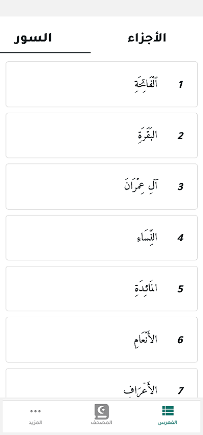

# القوائم

توفر ميزة القوائم في تطبيق المصحف المفتوح طريقة سهلة للوصول إلى قوائم السور والأجزاء والصفحات والعلامات المرجعية. تساعدك هذه الميزة على التنقل بسرعة بين أجزاء القرآن الكريم المختلفة.

## قائمة السور

### الوصول إلى قائمة السور

1. انقر على زر "السور" في القائمة السفلية.
2. ستظهر قائمة بجميع سور القرآن الكريم مرتبة حسب ترتيبها في المصحف.

### معلومات السورة

تعرض قائمة السور المعلومات التالية لكل سورة:

- **اسم السورة**: اسم السورة باللغة العربية.
- **رقم السورة**: رقم السورة حسب ترتيبها في المصحف.
- **عدد الآيات**: عدد آيات السورة.
- **مكان النزول**: مكية أو مدنية.

### البحث في قائمة السور

1. انقر على أيقونة البحث في أعلى قائمة السور.
2. اكتب اسم السورة أو جزءًا منها.
3. ستظهر نتائج البحث تلقائيًا أثناء الكتابة.

### تصفية قائمة السور

يمكنك تصفية قائمة السور حسب:

- **الكل**: عرض جميع السور.
- **المكية**: عرض السور المكية فقط.
- **المدنية**: عرض السور المدنية فقط.

## قائمة الأجزاء

### الوصول إلى قائمة الأجزاء

1. انقر على زر "الأجزاء" في القائمة السفلية.
2. ستظهر قائمة بجميع أجزاء القرآن الكريم (30 جزء).

### معلومات الجزء

تعرض قائمة الأجزاء المعلومات التالية لكل جزء:

- **رقم الجزء**: رقم الجزء من 1 إلى 30.
- **اسم الجزء**: اسم الجزء (مثل "الم" للجزء الأول).
- **بداية الجزء**: السورة والآية التي يبدأ بها الجزء.
- **نهاية الجزء**: السورة والآية التي ينتهي بها الجزء.

## قائمة الصفحات

### الوصول إلى قائمة الصفحات

1. انقر على زر "الصفحات" في القائمة السفلية.
2. ستظهر قائمة بصفحات المصحف (604 صفحة).

### الانتقال إلى صفحة محددة

1. في قائمة الصفحات، يمكنك التمرير لأعلى أو لأسفل للوصول إلى الصفحة المطلوبة.
2. يمكنك أيضًا استخدام شريط التمرير الجانبي للتنقل بسرعة بين الصفحات.
3. انقر على رقم الصفحة للانتقال إليها مباشرة.

## قائمة العلامات المرجعية

### الوصول إلى قائمة العلامات المرجعية

1. انقر على زر "العلامات المرجعية" في القائمة السفلية.
2. ستظهر قائمة بجميع العلامات المرجعية التي قمت بإضافتها.

### إدارة العلامات المرجعية

- **إضافة علامة مرجعية**: اضغط مطولاً على الآية أو الصفحة واختر "إضافة علامة مرجعية".
- **تعديل علامة مرجعية**: اضغط مطولاً على العلامة المرجعية في القائمة واختر "تعديل".
- **حذف علامة مرجعية**: اضغط مطولاً على العلامة المرجعية في القائمة واختر "حذف".

### تنظيم العلامات المرجعية

- **إنشاء مجلد**: يمكنك إنشاء مجلدات لتنظيم العلامات المرجعية.
- **نقل العلامات المرجعية**: يمكنك نقل العلامات المرجعية بين المجلدات.
- **ترتيب العلامات المرجعية**: يمكنك ترتيب العلامات المرجعية حسب تاريخ الإضافة أو اسم السورة.

## قائمة المحفوظات

### الوصول إلى قائمة المحفوظات

1. انقر على زر "المحفوظات" في القائمة السفلية.
2. ستظهر قائمة بآخر الصفحات والآيات التي قمت بزيارتها.

### إدارة المحفوظات

- **مسح المحفوظات**: يمكنك مسح سجل المحفوظات من خلال النقر على زر "مسح المحفوظات".
- **تعطيل المحفوظات**: يمكنك تعطيل تسجيل المحفوظات من خلال إعدادات التطبيق.

## قائمة الملاحظات

### الوصول إلى قائمة الملاحظات

1. انقر على زر "الملاحظات" في القائمة السفلية.
2. ستظهر قائمة بجميع الملاحظات التي قمت بإضافتها.

### إدارة الملاحظات

- **إضافة ملاحظة**: اضغط مطولاً على الآية واختر "إضافة ملاحظة".
- **تعديل ملاحظة**: انقر على الملاحظة في القائمة لتعديلها.
- **حذف ملاحظة**: اسحب الملاحظة إلى اليسار واضغط على زر "حذف".

# القوائم

## الانتقال إلى الأقسام الأخرى

- [واجهة المصحف](./mushaf_interface.md)
- [القائمة العلوية](./top_menu.md)
- [التفسير](./tafseer.md)
- [البحث](./search.md)
- [التنقل](./navigation.md)
- [الورد اليومي](./tracker.md)
- [الإعدادات](./settings.md)
- [العودة إلى الصفحة الرئيسية](./README.md)
