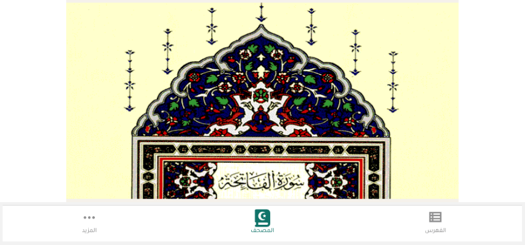
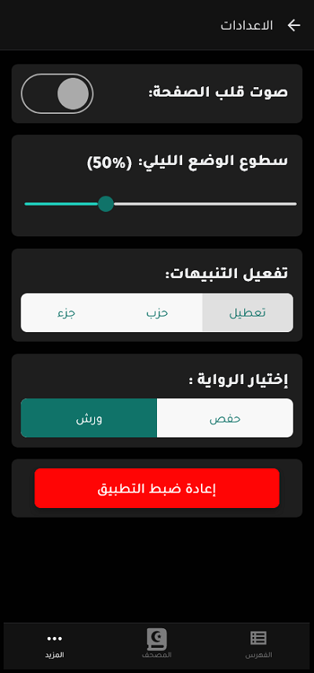

# واجهة المصحف الرئيسية

واجهة المصحف الرئيسية هي الشاشة الأساسية في التطبيق حيث يمكنك قراءة القرآن الكريم وتصفح صفحاته. تم تصميم هذه الواجهة لتكون سهلة الاستخدام وتوفر تجربة قراءة مريحة.

## التنقل بين الصفحات

يمكنك التنقل بين صفحات المصحف بطريقة سهلة وبديهية:

- **السحب الأفقي**: يمكنك التنقل بين الصفحات عن طريق السحب نحو اليمين أو نحو اليسار، تمامًا مثل تقليب صفحات الكتاب الورقي.
- **النقر على حواف الشاشة**: يمكنك النقر على الجانب الأيمن من الشاشة للانتقال إلى الصفحة التالية، أو النقر على الجانب الأيسر للانتقال إلى الصفحة السابقة.

## وضع ملء الشاشة

يمكنك تفعيل وضع ملء الشاشة لإخفاء القوائم العلوية والسفلية والتركيز على قراءة القرآن الكريم:

1. انقر على أيقونة ملء الشاشة في القائمة العلوية (أيقونة التوسيع).
2. ستختفي القوائم وستظهر صفحة المصحف بشكل كامل على الشاشة.
3. للعودة إلى الوضع العادي، انقر مرة أخرى على أي مكان في الشاشة.

## الوضع الليلي

يوفر التطبيق وضع القراءة الليلي لراحة العين أثناء القراءة في الظلام:

- يمكنك تفعيل الوضع الليلي من خلال إعدادات التطبيق.
- يمكنك ضبط سطوع الوضع الليلي حسب تفضيلاتك من خلال شريط التمرير في صفحة الإعدادات.

## الوضع الأفقي

يدعم التطبيق الوضع الأفقي (Landscape) لعرض المصحف بشكل أوسع:

- قم بتدوير جهازك إلى الوضع الأفقي لتفعيل هذه الميزة.
- يتم تعديل عرض صفحة المصحف تلقائيًا لتناسب الشاشة الأفقية.
- هذا الوضع مفيد بشكل خاص عند قراءة القرآن على الأجهزة اللوحية.

## التفاعل مع الصفحة

- **الضغط المطول**: اضغط مطولاً على أي مكان في صفحة المصحف لفتح قائمة التفسير.
- **التكبير والتصغير**: يمكنك استخدام إيماءة القرص (pinch) للتكبير والتصغير في صفحة المصحف للتركيز على أجزاء معينة من النص.

## الانتقال إلى الأقسام الأخرى

- [القائمة العلوية](./top_menu.md)
- [التفسير](./tafseer.md)
- [البحث](./search.md)
- [التنقل](./navigation.md)
- [الورد اليومي](./tracker.md)
- [الإعدادات](./settings.md)
- [القوائم](./lists.md)
- [العودة إلى الصفحة الرئيسية](./README.md)
