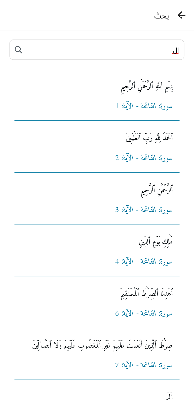

# البحث في القرآن الكريم

يوفر تطبيق المصحف المفتوح ميزات بحث متقدمة تمكنك من البحث في القرآن الكريم بسهولة وسرعة. يمكنك البحث عن كلمات أو عبارات محددة والعثور على جميع الآيات التي تحتوي عليها.

## كيفية استخدام البحث

1. انقر على أيقونة البحث في القائمة العلوية (أيقونة العدسة المكبرة).
2. اكتب الكلمة أو العبارة التي ترغب في البحث عنها في حقل البحث.
3. اضغط على زر البحث أو مفتاح الإدخال في لوحة المفاتيح.
4. ستظهر نتائج البحث مع تمييز الكلمات المطابقة في الآيات.

## خيارات البحث المتقدمة

### البحث الدقيق

- يمكنك تفعيل خيار "البحث الدقيق" للبحث عن العبارة بالضبط كما كتبتها.
- عند تعطيل هذا الخيار، سيتم البحث عن الكلمات بشكل منفصل في الآية.

### البحث بالتشكيل

- يمكنك تفعيل خيار "البحث بالتشكيل" للبحث مع مراعاة علامات التشكيل.
- هذا مفيد عندما تريد البحث عن كلمات محددة بتشكيل معين.

### تصفية نتائج البحث

يمكنك تصفية نتائج البحث حسب:

- **السورة**: اختر سورة محددة للبحث فيها فقط.
- **الجزء**: اختر جزءًا محددًا للبحث فيه فقط.
- **الصفحة**: اختر صفحة محددة للبحث فيها فقط.

## عرض نتائج البحث

- تظهر نتائج البحث في قائمة مع رقم الآية واسم السورة.
- يتم تمييز الكلمات المطابقة في نتائج البحث.
- يمكنك النقر على أي نتيجة للانتقال مباشرة إلى الآية في المصحف.

## حفظ عمليات البحث

- يحتفظ التطبيق بسجل لعمليات البحث السابقة.
- يمكنك الوصول إلى عمليات البحث السابقة من خلال قائمة البحث.
- يمكنك مسح سجل البحث من خلال إعدادات التطبيق.

# البحث في القرآن الكريم

## الانتقال إلى الأقسام الأخرى

- [واجهة المصحف](./mushaf_interface.md)
- [القائمة العلوية](./top_menu.md)
- [التفسير](./tafseer.md)
- [التنقل](./navigation.md)
- [الورد اليومي](./tracker.md)
- [الإعدادات](./settings.md)
- [القوائم](./lists.md)
- [العودة إلى الصفحة الرئيسية](./README.md)
