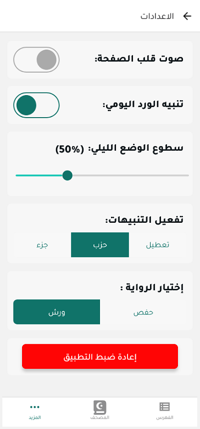

# الإعدادات

توفر صفحة الإعدادات في تطبيق المصحف المفتوح مجموعة متنوعة من الخيارات لتخصيص تجربة استخدام التطبيق وفقًا لتفضيلاتك الشخصية. يمكنك الوصول إلى الإعدادات من خلال النقر على أيقونة الإعدادات (⚙️) في القائمة العلوية.

## إعدادات العرض

### المظهر

- **الوضع الليلي**: تفعيل أو تعطيل الوضع الليلي للقراءة في الإضاءة المنخفضة.
- **اتباع نظام الجهاز**: مزامنة مظهر التطبيق مع إعدادات الجهاز (الوضع الفاتح/الداكن).
- **سطوع الشاشة**: ضبط مستوى سطوع الشاشة داخل التطبيق.

### المصحف

- **نوع الخط**: اختيار نوع الخط المستخدم لعرض القرآن الكريم.
  - خط عثمان طه
  - خط المدينة المنورة
  - خط الحرمين الشريفين
  - خط القلم
- **حجم الخط**: تكبير أو تصغير حجم خط القرآن الكريم.
- **لون الخط**: تغيير لون خط القرآن الكريم.
- **لون خلفية الصفحة**: تغيير لون خلفية صفحة المصحف.

### التفسير

- **نوع خط التفسير**: اختيار نوع الخط المستخدم لعرض التفسير.
- **حجم خط التفسير**: تكبير أو تصغير حجم خط التفسير.

## إعدادات القراءة

### التلاوة

- **تفعيل التلاوة**: تشغيل أو إيقاف ميزة التلاوة الصوتية.
- **اختيار القارئ**: اختيار القارئ المفضل من قائمة القراء المتاحين.
- **سرعة التلاوة**: ضبط سرعة التلاوة الصوتية.
- **التشغيل التلقائي**: تفعيل أو تعطيل التشغيل التلقائي للتلاوة عند فتح صفحة جديدة.

### التنقل

- **حفظ آخر موضع قراءة**: تفعيل أو تعطيل حفظ آخر موضع قراءة عند إغلاق التطبيق.
- **عرض شريط التنقل**: إظهار أو إخفاء شريط التنقل في أسفل الشاشة.
- **اتجاه التنقل**: تحديد اتجاه التنقل بين الصفحات (من اليمين إلى اليسار أو العكس).

## إعدادات اللغة والترجمة

- **لغة واجهة التطبيق**: اختيار لغة واجهة المستخدم.
  - العربية
  - الإنجليزية
  - الفرنسية
  - وغيرها من اللغات المتاحة
- **ترجمة معاني القرآن**: اختيار ترجمة معاني القرآن الكريم.
  - الإنجليزية (يوسف علي، محمد أسد، وغيرهم)
  - الفرنسية
  - الأردية
  - وغيرها من الترجمات المتاحة
- **إظهار الترجمة**: تفعيل أو تعطيل عرض الترجمة مع النص القرآني.

## إعدادات الإشعارات

- **تذكيرات القراءة**: ضبط تذكيرات لقراءة القرآن الكريم في أوقات محددة.
- **إشعارات الورد اليومي**: تفعيل أو تعطيل إشعارات تذكير الورد اليومي.
- **إشعارات التحديثات**: تفعيل أو تعطيل إشعارات تحديثات التطبيق.

## إعدادات متقدمة

- **حفظ البيانات**: تحديد مكان حفظ بيانات التطبيق (الذاكرة الداخلية أو بطاقة SD).
- **مزامنة البيانات**: تفعيل أو تعطيل مزامنة البيانات مع حساب المستخدم.
- **تنزيل البيانات للاستخدام دون اتصال**: تنزيل بيانات القرآن والتفاسير للاستخدام دون اتصال بالإنترنت.
- **مسح ذاكرة التخزين المؤقت**: مسح البيانات المؤقتة لتوفير مساحة تخزين.

## إعادة ضبط الإعدادات

- **إعادة ضبط إلى الإعدادات الافتراضية**: إعادة جميع إعدادات التطبيق إلى الوضع الافتراضي.
- **مسح جميع البيانات**: مسح جميع البيانات المخزنة في التطبيق (الإشارات المرجعية، سجل القراءة، إلخ).

# الإعدادات

## الانتقال إلى الأقسام الأخرى

- [واجهة المصحف](./mushaf_interface.md)
- [القائمة العلوية](./top_menu.md)
- [التفسير](./tafseer.md)
- [البحث](./search.md)
- [التنقل](./navigation.md)
- [الورد اليومي](./tracker.md)
- [القوائم](./lists.md)
- [العودة إلى الصفحة الرئيسية](./README.md)
