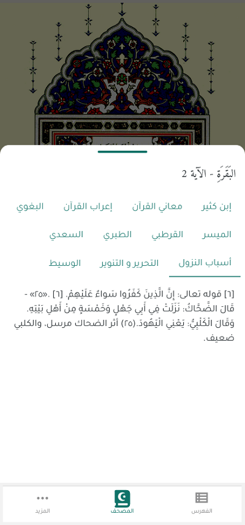

# التفسير

توفر ميزة التفسير في تطبيق المصحف المفتوح إمكانية الوصول إلى تفاسير متعددة للقرآن الكريم، مما يساعدك على فهم معاني الآيات بشكل أفضل. يمكنك الاطلاع على تفاسير من علماء مختلفين.

## الوصول إلى التفسير

1. اضغط مطولاً على الآية التي ترغب في رؤية تفسيرها.
2. ستظهر قائمة منبثقة تحتوي على تفسير الآية المختارة.
3. اختر التفسير الذي ترغب في قراءته.

## التفاسير المتاحة

يوفر التطبيق مجموعة من التفاسير المعتمدة، منها:

- **تفسير البغوي**: تفسير الشيخ البغوي.
- **تفسير ابن كثير**: تفسير شامل للقرآن الكريم للإمام ابن كثير.
- **إعراب القرآن الكريم**: يوفر إعرابا للقرآن الكريم.
- **تفسير المعاني**: يوفر شرحا لمعني كلمات القرآن الكريم.
- **تفسير السعدي**: تفسير الشيخ عبد الرحمن السعدي.
- **تفسير الطبري**: تفسير الإمام محمد بن جرير الطبري.
- **تفسير القرطبي**: تفسير الإمام القرطبي.
- **التفسير الميسر**: تفسير مبسط من مجمع الملك فهد لطباعة المصحف الشريف.

## التفسير

## الانتقال إلى الأقسام الأخرى

- [واجهة المصحف](./mushaf_interface.md)
- [القائمة العلوية](./top_menu.md)
- [البحث](./search.md)
- [التنقل](./navigation.md)
- [الورد اليومي](./tracker.md)
- [الإعدادات](./settings.md)
- [القوائم](./lists.md)
- [العودة إلى الصفحة الرئيسية](./README.md)
