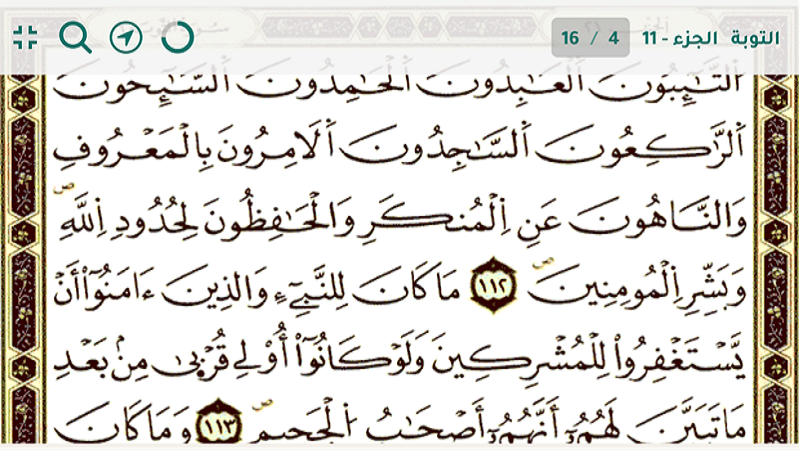

# القائمة العلوية

القائمة العلوية هي جزء أساسي من واجهة التطبيق وتحتوي على معلومات مهمة ووظائف متعددة تساعدك على استخدام التطبيق بكفاءة.

## مكونات القائمة العلوية

### معلومات الصفحة الحالية

تعرض القائمة العلوية معلومات مهمة عن الصفحة الحالية التي تقرأها:

- **اسم السورة**: يظهر اسم السورة الموجودة في الصفحة الحالية.
- **رقم الجزء**: يعرض رقم الجزء الحالي من القرآن الكريم.
- **موضع الثمن في الجزء**: يوضح موقع الثمن الحالي ضمن الجزء.

### مؤشر تقدم الورد اليومي

يظهر في القائمة العلوية مؤشر تقدم دائري يعرض نسبة إنجازك للورد اليومي:

- يتم تحديث المؤشر تلقائيًا كلما تقدمت في القراءة.
- يمكنك النقر على المؤشر للانتقال إلى صفحة تتبع الورد اليومي.
- عند إكمال الورد اليومي، سيظهر المؤشر باللون الأخضر مع علامة صح.

## أيقونات القائمة العلوية

### أيقونة التنقل

تتيح لك التنقل إلى شاشة الانتقال السريع.

### أيقونة البحث

تتيح لك التنقل إلى شاشة البحث في نص القرآن الكريم.

### أيقونة ملء الشاشة

تقوم أيقونة ملء الشاشة بإظهار أو إخفاء القائمة السفلية لعرض الصفحة بشكل كامل:

- انقر على أيقونة ملء الشاشة لتفعيل وضع ملء الشاشة.
- ستختفي القوائم وستظهر صفحة المصحف بشكل كامل على الشاشة.
- للعودة إلى الوضع العادي، انقر مرة أخرى على نفس الأيقونة.

## استخدام القائمة العلوية بفعالية

- يمكنك الوصول إلى القائمة العلوية في أي وقت أثناء تصفح المصحف.
- إذا كانت القائمة العلوية مخفية ، يمكنك النقر على أي مكان في الشاشة لإظهارها مؤقتًا.
- استخدم المعلومات المعروضة في القائمة العلوية لمعرفة موقعك الحالي في المصحف.

# القائمة العلوية

## الانتقال إلى الأقسام الأخرى

- [واجهة المصحف](./mushaf_interface.md)
- [التفسير](./tafseer.md)
- [البحث](./search.md)
- [التنقل](./navigation.md)
- [الورد اليومي](./tracker.md)
- [الإعدادات](./settings.md)
- [القوائم](./lists.md)
- [العودة إلى الصفحة الرئيسية](./README.md)
