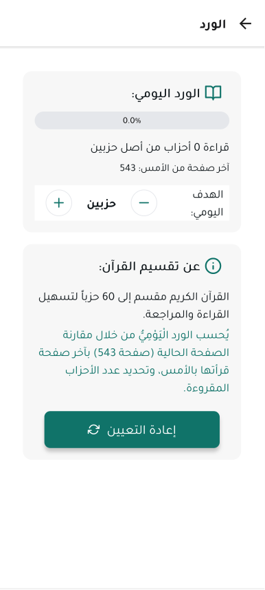

# الورد اليومي

توفر ميزة الورد اليومي في تطبيق المصحف المفتوح طريقة سهلة لتتبع تقدمك في قراءة القرآن الكريم وتحديد أهداف يومية للقراءة. هذه الميزة تساعدك على الالتزام بورد يومي منتظم من القرآن الكريم.

## تحديد هدف القراءة اليومي

1. انتقل إلى قسم "الورد اليومي" من القائمة الرئيسية أو من خلال النقر على أيقونة التتبع في القائمة العلوية.
2. اضغط على زر "تحديد هدف" لتعيين هدفك اليومي.
3. يمكنك تحديد الهدف بعدة طرق:
   - عدد الصفحات: تحديد عدد معين من الصفحات للقراءة يومياً.
   - عدد الأجزاء: تحديد عدد معين من الأجزاء للقراءة يومياً.
   - عدد الآيات: تحديد عدد معين من الآيات للقراءة يومياً.
   - وقت القراءة: تحديد مدة زمنية معينة للقراءة يومياً.

## تسجيل القراءة

- يقوم التطبيق تلقائياً بتسجيل تقدمك في القراءة أثناء استخدامك للمصحف.
- يمكنك أيضاً تسجيل القراءة يدوياً من خلال الضغط على زر "تسجيل قراءة" وتحديد ما قرأته.
- عند الانتهاء من القراءة، يمكنك الضغط على زر "إنهاء القراءة" لتسجيل الوقت المستغرق.

## عرض الإحصائيات والتقدم

- **التقدم اليومي**: يعرض نسبة إكمال هدفك اليومي.
- **سجل القراءة**: يعرض سجل قراءتك على مدار الأيام والأسابيع والشهور.
- **الإحصائيات**: يعرض إحصائيات مفصلة عن قراءتك مثل:
  - إجمالي الوقت المستغرق في القراءة.
  - متوسط وقت القراءة اليومي.
  - عدد الأيام المتتالية من القراءة.
  - عدد الختمات المكتملة.

## تذكيرات القراءة

- يمكنك ضبط تذكيرات يومية لقراءة وردك.
- انتقل إلى إعدادات الورد اليومي واضغط على "إضافة تذكير".
- حدد الوقت الذي ترغب في تلقي التذكير فيه.
- يمكنك إضافة تذكيرات متعددة في أوقات مختلفة من اليوم.

## مشاركة التقدم

- يمكنك مشاركة تقدمك في قراءة القرآن مع الأصدقاء والعائلة.
- اضغط على زر "مشاركة" في صفحة الإحصائيات.
- اختر تطبيق المشاركة المفضل لديك (واتساب، تويتر، فيسبوك، إلخ).

## إعادة ضبط التقدم

- يمكنك إعادة ضبط تقدمك في أي وقت من خلال الضغط على "إعادة ضبط" في إعدادات الورد اليومي.
- يمكنك اختيار إعادة ضبط التقدم اليومي فقط أو إعادة ضبط جميع الإحصائيات.

# الورد اليومي

## الانتقال إلى الأقسام الأخرى

- [واجهة المصحف](./mushaf_interface.md)
- [القائمة العلوية](./top_menu.md)
- [التفسير](./tafseer.md)
- [البحث](./search.md)
- [التنقل](./navigation.md)
- [الإعدادات](./settings.md)
- [القوائم](./lists.md)
- [العودة إلى الصفحة الرئيسية](./README.md)
